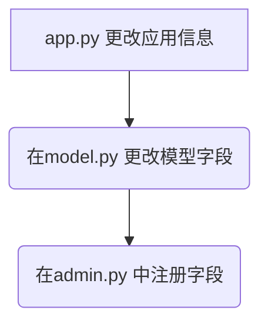

# 开发模型类

## 在apps.py 更改应用信息
```python
...
class CouserConfig(AppConfig):
  name = 'courser',
  verbose_name = '课程信息' # 改成中文
```

## 在model.py 更改模型字段
```python
...
from django.conf import settings

class Couser(models.Model):
    """
    CharField 基本类型字段
    max_length 设置字段为255，
    unique 课程名称唯一
    help_text 字段的注解或者表单校验提示信息
    """

    name = models.CharField(
        max_length=255, unique=True, help_text="课程名称", verbose_name="名称"
    )

    """
  TextField 不限制长度
  """
    introduction = models.TextField(help_text="课程介绍", verbose_name="介绍")

    """
  settings.AUTH_USER_MODEL 关联到认证用户的模型类 也就是user表
  on_delete 删除级联
  """
    teacher = models.ForeignKey(
        settings.AUTH_USER_MODEL,
        on_delete=models.CASCADE,
        help_text="课程讲师",
        verbose_name="讲师",
    )

    """
  max_digits 总长度 6位
  decimal_places 小数两位
  """
    price = models.DecimalField(
        max_digits=6, decimal_places=2, help_text="课程介绍", verbose_name="介绍"
    )

    """
  创建时间自动添加
  """
    created_at = models.DateTimeField(auto_now_add=True, verbose_name="创建时间")
    updated_at = models.DateTimeField(auto_now=True, verbose_name="更新时间")

    # 元数据 ---<这里会显示中文>
    class Meta:
        verbose_name = "课程信息"
        # 复数也是一样
        verbose_name_plural = verbose_name
        # 增加一个排序
        ordering = ("price",)

    # 模型类实例
    def __str__(self):
        return self.name
```

**接下来我们把这些字段注册到 后台去，方便我们添加数据的时候 直接从admin后台直接加**


## 在admin.py 中注册字段
```python
from django.contrib import admin
# 导入模型类
from .models import Course

# Django 框架中用于注册模型（Model）到管理后台的装饰器
@admin.register(Course)
class CourseAdmin(admin.ModelAdmin):
    # list_display 需要显示的字段
    list_display = ("name", "introduction", "teacher", "price")

    # search_fields 需要搜索的字段
    search_fields = list_display

    # list_filter 需要过滤的字段
    list_filter = list_display

    # list_editable 可编辑的字段
    # style_fields 在编辑视图中的显示效果 形如css
```

**记得`makemigrations`和`migrate`**